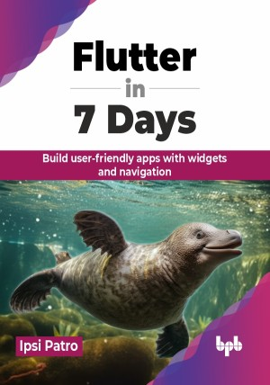

# Flutter in 7 Days

The best place to start your journey toward becoming a full-fledged Flutter developer

This is the repository for [Flutter in 7 Days
](https://bpbonline.com/products/flutter-in-7-days),published by BPB Publications.

## About the Book
Flutter in 7 Days is a comprehensive guide to mastering Flutter, the cross-platform mobile development framework that allows developers to build stunning Android and iOS apps from a single codebase. This book will teach you everything you need to know about Flutter and Dart, which is the language behind Flutter.

Starting from scratch, you will learn the fundamentals of Dart programming, followed by a deep dive into Flutter's versatile widgets and state management techniques. Each chapter is designed to build your skills progressively, enabling you to create responsive and interactive user interfaces. You will also explore how to connect your app to the web with network calls and JSON parsing, navigate between different screens, and integrate Firebase for powerful features like user authentication and data storage in Firestore and managing app state efficiently.

By the end of this book, you will be equipped with the knowledge and confidence to develop any mobile app using Flutter. This book not only covers the technical aspects but also provides practical insights and tips to enhance your productivity. 

## What You Will Learn
• Build and run Flutter applications on both Android and iOS.

• Understand Dart programming fundamentals for Flutter development.

• Create responsive and interactive user interfaces with Flutter widgets.

• Implement state management for maintaining the app state efficiently.

• Fetch and display data from the internet using REST APIs.

• Integrate Firebase for authentication, database, and notifications.
